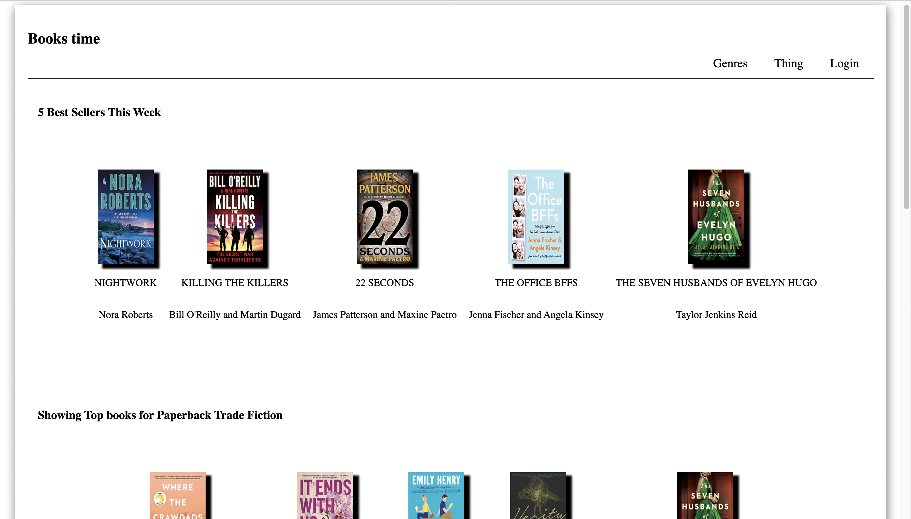

# Journey Sharing (Work in Progress)
[Link to Website](#)
> not working currently

Is a website for users to share their favourite books with friends family members, and other users around the world. 
Journey Sharing is the place to find the bestseller of this week, recommended a random genre of books based on the NYT Genres list, 
Fiction, and non-Fiction books. Journey Sharing will allow users to create an account and add books to either their Favourites List or
Reading Next List. Also, users will be able to share both their list just by sharing their username or Link to their page.

### Mission
To create a website to get more people into reading and for people to share their favourite book or the most recent book they have read.
I want to make it as simple as possible to add any book to either of their list and share their username for everyone to see.
Created a Fullstack application using vanilla HTML, CSS, and JavaScript. Have not decided on the backend support yet. However, will decide at a later date. Will include Frameworks like node.js and others at a later date.
Will probably use Firebase as the database and react to help with the javascript

### 

### Created by
[Edison Wei](https://github.com/Dreamz2)
